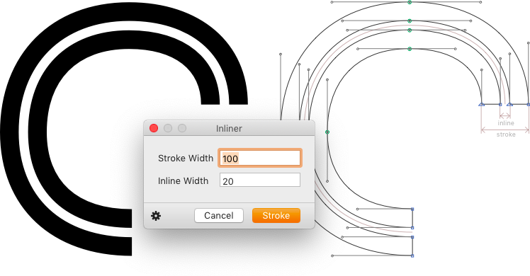

# Inliner

This is a plugin for the [Glyphs font editor](http://glyphsapp.com/). After installation, it will add the menu item *Filer > Inliner.* You can set a keyboard shortcut in System Preferences. The filter will expand a skeleton path to an inlined stroke:

* *Stroke Width* is the complete width of the (double) stroke.
* *Inline Width* is the width of the white gap inside the stroke.

In the number fields, use up and down arrows for adjusting the value by one unit. Hold down Shift for increments of 10 units, Cmd-Shift for increments of 100 units.

### Installation

1. One-click install *Inliner* from *Window > Plugin Manager*
2. Restart Glyphs.

### License

Copyright 2019 Rainer Erich Scheichelbauer (@mekkablue).
Based on sample code by Georg Seifert (@schriftgestalt) and Jan Gerner (@yanone). Thanks to Tan Sueh Li for the idea.

Licensed under the Apache License, Version 2.0 (the "License");
you may not use this file except in compliance with the License.
You may obtain a copy of the License at

http://www.apache.org/licenses/LICENSE-2.0

See the License file included in this repository for further details.
